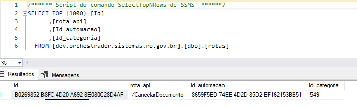

# ORChestrador

## O que é o ORChestrador?

O ORChestrador é um micro-serviço que serve para orquestrar entre o micro-serviço glpi-core-middleware(projeto autobots) e qualquer outra api que atenda um chamado. Em resumo, basta adicionar no banco de dados as configurações e... pronto! O ORChestrador vai reconhecer o seu serviço e começar a encaminhar os requests.

## Integrando com o Orchestrador!

Para integrar com o Orchestrador, você precisa de uma rota de Api que recebe requests POST no formato JSON, obrigatóriamente com um campo sendo o ticketId(campo inteiro).

### Exemplo Prático de Integração: 

Considerando a rota a seguir: 

Nessa api você tem a url: https://seiapirest.development.local
Uma rota: /CancelarDocumento
e Um Corpo Json.

Para configurar o ORChestrador para reconhecer essa API, basta conectar no banco e preencher uma linha na tabela automação com a url da mesma:

E então configurar a Rota, especificando qual categoria de chamado esta Rota irá atender:

E então devem-se configurar os campos que a api espera, na tabela campos_rota:

e.... pronto! Do lado do ORChestrador, você já está integrado.

